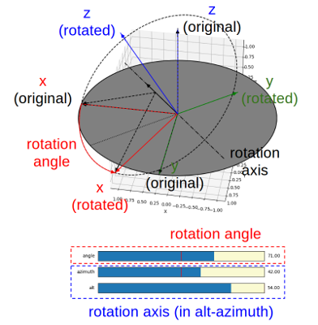
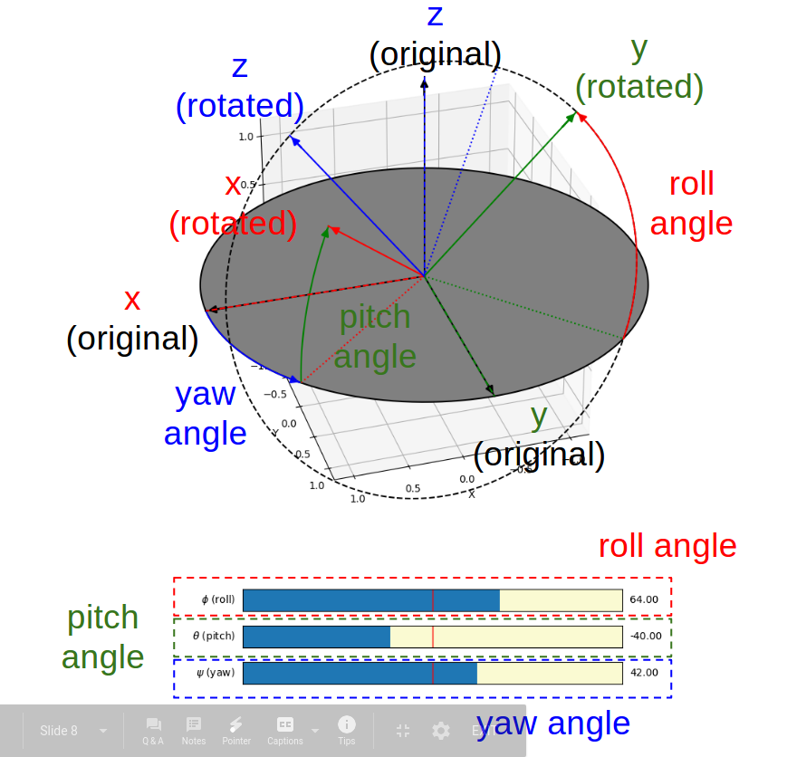
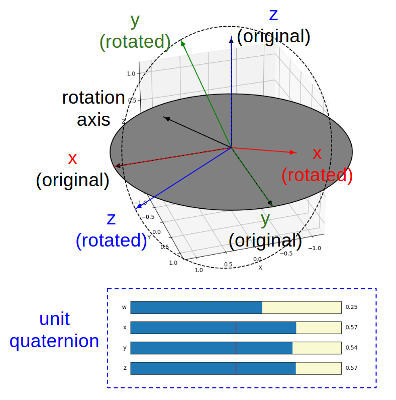

# pyrotation
This repository is a Python package to help teach and learn the math of 3D rotation. It has two modules:

* [pyrotation_demo.py](https://github.com/duolu/pyrotation/blob/master/pyrotation/pyrotation_demo.py) - contains GUI based interactive demo of 3D rotation of reference frame.
* [pyrotation.py](https://github.com/duolu/pyrotation/blob/master/pyrotation/pyrotation.py) - contains the core class and routines for representation and operation of 3D rotation.

Both modules are tested on Python 3.5+.

## pyrotation_demo.py

The **pyrotation_demo** module provides four interactive GUI visualizers based on the matplotlib, corresponding to the four representations of the 3D rotation. Users can drag sliders to directly change parameters of the representation and the corresponding rotation of reference frame is shown in real-time. 

This module requires numpy, matplotlib, and the **pyrotation** module. 

## pyrotation.py

The **pyrotation** module provides four different representations of a 3D rotation as well as corresponding operations on these representations:

* **Angle-axis** - represented as a numpy 3-dimensional vector **u**, where its direction is the axis and its length is the angle (could be negative). The rotation follows the right-hand rule.
* **Euler angles** (in z-y'-x" intrinsic convention) - represented as a tuple of three angles (z, y, x). These angles are also called Tait-Bryan angles, or (yaw, pitch, roll) angles.
* **Rotation matrix** - represented as a numpy 3-by-3 matrix **R**.
* **Unit quaternion** - represented as an object **q** of a custom quaternion class defined in the pyrotation module.

This module requires numpy. 

# Getting Started

## Installation

Just download pyrotation.py and pyrotation_demo.py and run.

## Basic Usage of pyrotation_demo

Put both **pyrotation.py** and **pyrotation_demo.py**

	$ python3 ./pyrotation_demo.py [mode]

The "mode" can be one of the following:

* "u" or "angle_axis" - angle-axis (default if mode is not given)
* "e" or "euler" - Euler angles (in z-y'-x" intrinsic convention)
* "r" or "R" or "rotation_matrix" - rotation matrix
* "q" or "quaternion" - unit quaternion

For example, if the following command is used,

	$ python3 ./pyrotation_demo.py q

Then the demo with quaternion is shown.

### Demo of Angle-Axis Representation of a 3D Rotation

 

The rotation angle and the rotation axis can be directly controlled by the three sliders. Note that to control the axis, alt-azimuth angles of the axis are used.

### Demo of Euler Angles Representation of a 3D Rotation

 

The three Euler angles can be directly controlled by the three sliders.

### Demo of Rotation Matrix Representation of a 3D Rotation

 

### Demo of Quaternion Representation of a 3D Rotation

 

The four components of the unit quaternion can be directly controlled by the four sliders. Note that since it is a the four components are coupled and the user can not change one component without influence to others. This demo program provides two manipulations in general: (1) Changing the rotation angle while maintaining the axis, by manipulating qw, or (2) Changing the axis direction while maintaining the angle, by manipulating qx, qy, qz and setting qw to 0.

## Basic Usage of pyrotation

// TODO

